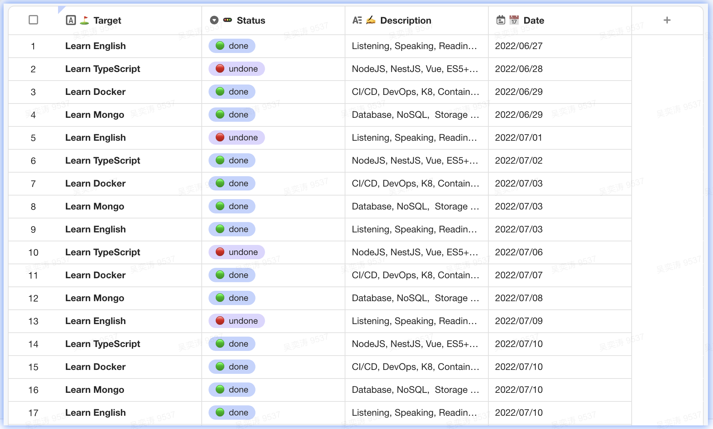
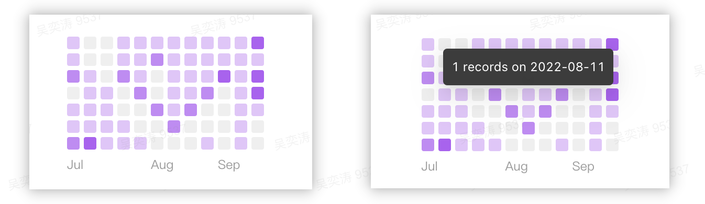
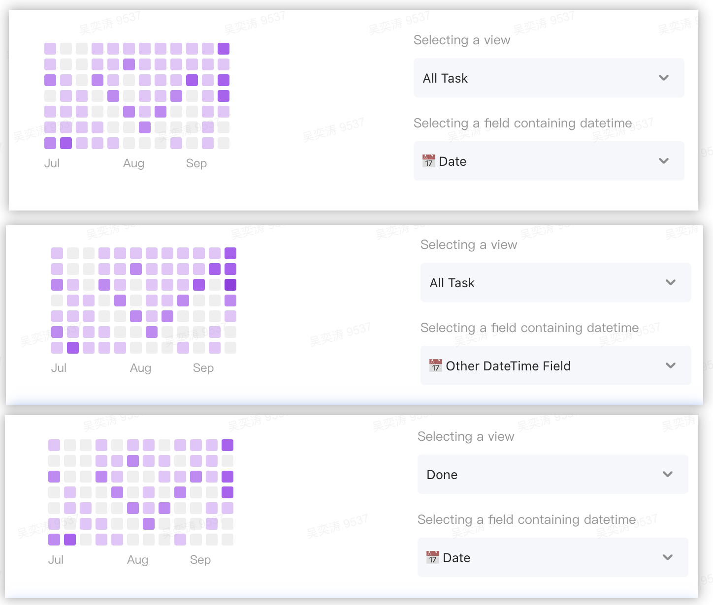

### Widget: Contributes Graph

#### 👋 Introduce

Github count our commit and displays the result on the contribution graph. Now, this widget can count the vikadata's datasheet's records and displays the result on the same style graph.

Let's look at the usage scenario.

#### 🚀 Using

we have the following datasheet.

  

Installing this widget in to your widgets. You can get the count graph. If you move your course into the box, you will see the tooltip.

  

You can config this graph.

  

